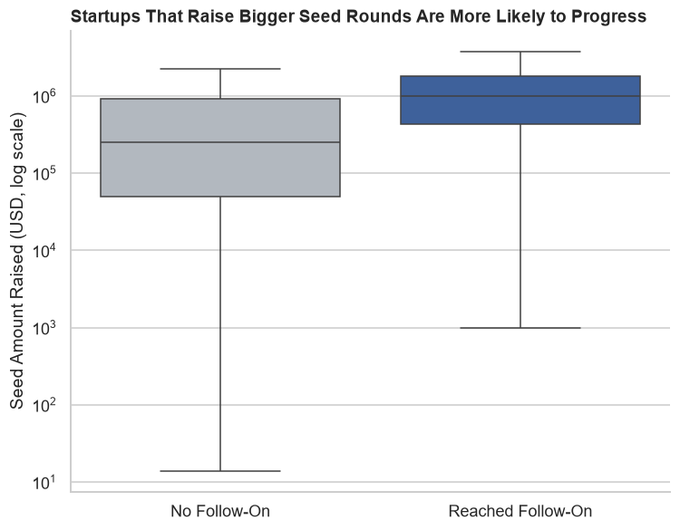
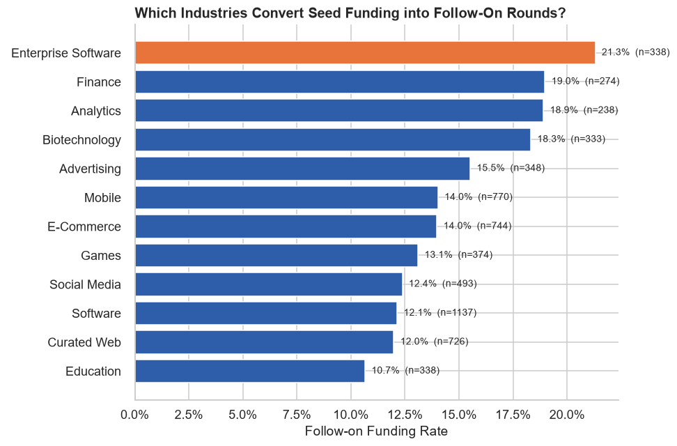
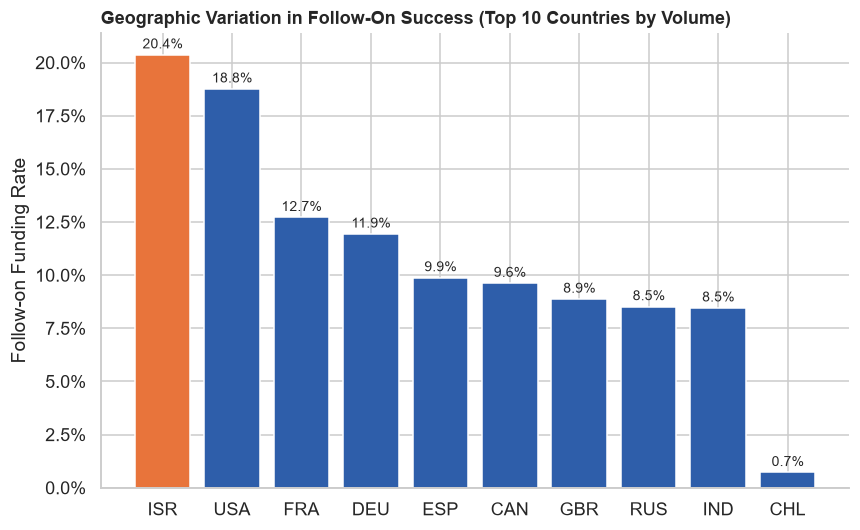

# Optimal Funding Trajectories for Follow-On Investment
### Project 2: Exploratory Data Analysis — Startup Investments (Crunchbase)

---

## Problem Statement

A venture capital firm struggles to reliably select seed-stage startups that will go on to raise follow-on funding, resulting in a portfolio of stalled companies; this project analyzes historical Crunchbase funding data to uncover the factors most associated with follow-on success and translate them into data-driven $10M seed-stage investment criteria.

---

## Executive Summary

This project analyzes a historical Crunchbase dataset of ~54,000 companies, isolating a cohort of seed-stage startups (those that raised seed and/or angel funding) to study what separates companies that go on to raise a follow-on round (Series A or later) from those that stall. The process began with a thorough data cleaning phase — removing ~4,856 fully-blank rows and their resulting duplicates, correcting text-formatted numeric fields (`funding_total_usd`), converting float-with-NaN columns to nullable integers, parsing and sanity-checking date fields, and manually verifying and removing non-startup institutions (universities, telecoms, nonprofits) that had been mixed into the raw data. From there, an EDA phase examined follow-on success by seed check size, industry category, geography, funding round count, and time between rounds, backed by Mann-Whitney U and Chi-square tests to separate real patterns from noise.

The analysis found that only **13.4%** of seed-stage startups ever raise a follow-on round. The strongest predictor of success was **seed check size**: companies that progressed had a median seed round of **$742K**, nearly 5x the **$150K** median for companies that didn't (p < 0.001). **Industry category** and **geography** were also significant (both p < 0.001) — Enterprise Software, Finance, Analytics, and Biotechnology outperform the market average by roughly 1.5–2x, and the USA and Israel substantially outperform other major startup hubs. Among startups that do progress, the typical gap between their seed round and most recent round is **~768 days (~2.1 years)**. Notably, how quickly a startup closes its first round after founding showed **no significant relationship** with follow-on success (p = 0.23) — a useful negative finding.

Based on these patterns, the recommendation is to prioritize the firm's $10M seed-stage capital toward Enterprise Software, Fintech, Analytics, and Biotechnology startups; favor larger seed checks (at or above the ~$742K historical median); set an 18–24 month post-seed checkpoint to flag stalled investments; and weight US/Israel-based teams more favorably without excluding other regions. These findings are correlational, not causal, and the dataset's funding records run through roughly 2014, so they should be validated against more recent data before being finalized as investment criteria (see [Areas for Further Research](#areas-for-further-research--study)).

---

## File Directory

| File / Folder | Description |
| :--- | :--- |
| `README.md` | This file — project overview, findings, and documentation. |
| `data/startup_investments.csv` | Raw Crunchbase dataset (~54,000 companies, 39 columns). |
| `startup_investments_eda.ipynb` | Full analysis notebook: data cleaning, EDA, statistical testing, visualizations, and conclusions. |
| `images/` | Exported chart images referenced in this README. |
| `presentation/startup_investments_presentation.pdf` | Non-technical slide deck summarizing the project for stakeholders. |

---

## Data & Data Dictionary

**Source:** Crunchbase startup funding dataset — company profiles, funding rounds, and amounts raised, provided as part of the course's pre-assigned datasets (`data/startup_investments.csv`).

| Feature | Type | Description |
| :--- | :--- | :--- |
| `permalink` | string | Unique identifier URL path for each company profile. |
| `name` | string | Official operating name of the startup. |
| `homepage_url` | string | Company's primary website. |
| `category_list` | string | Raw list of industry categories/tags. |
| `market` | string | Primary industry/market segment (cleaned, whitespace-stripped). |
| `funding_total_usd` | float | Total funding raised across all rounds, in USD (cleaned from text). |
| `status` | string | Current operational state (operating, acquired, closed, etc.). |
| `country_code` | string | 3-letter ISO country code of company HQ. |
| `state_code` | string | Administrative state/province code of company HQ. |
| `region` | string | Broad geographic/metro region. |
| `city` | string | City of company HQ. |
| `funding_rounds` | int | Total number of distinct funding rounds raised. |
| `founded_month` / `founded_quarter` / `founded_year` | string / string / int | Founding date components. |
| `seed`, `angel`, `venture`, `equity_crowdfunding`, `undisclosed`, `convertible_note`, `debt_financing`, `grant`, `private_equity`, `post_ipo_equity`, `post_ipo_debt`, `secondary_market`, `product_crowdfunding` | float | Total capital raised via each specific funding mechanism, in USD. |
| `round_A` … `round_H` | float | Total amount raised in each respective Series A–H round, in USD. |
| `founded_at` / `first_funding_at` / `last_funding_at` | datetime | Parsed date fields; corrupted/implausible entries nulled per documented rules in the notebook. |
| **`reached_followon`** *(engineered)* | int (0/1) | 1 if the company recorded any funding in round_A–round_H, else 0. Defines "follow-on success." |
| **`seed_cohort`** *(engineered)* | subset | Boolean-masked subset of companies with seed and/or angel funding — the analysis population. |
| **`days_to_first_funding`** *(engineered)* | int | Days between `founded_at` and `first_funding_at`. |
| **`days_first_to_last`** *(engineered)* | int | Days between `first_funding_at` and `last_funding_at`, among companies that reached follow-on. |

A complete column-by-column dictionary (including every original column) is also included in Section 6.1 of `startup_investments_eda.ipynb`.

---

## Important Visualizations

**Seed check size is the strongest signal:** startups that reached follow-on funding raised a median seed round nearly 5x larger than those that didn't.

**Industry category shapes the odds:** Enterprise Software, Finance, Analytics, and Biotechnology convert seed funding into follow-on rounds at roughly 1.5–2x the rate of categories like Education.

**Geography matters:** Israel and the USA substantially outperform other major startup hubs in follow-on rate.

Additional visualizations (funding round count, and the multivariate interaction between industry and seed size) are available in Sections 4.9 and 4.14 of the analysis notebook.

---

## Conclusions & Recommendations

**Key Insights**
- Only ~13.4% of seed-stage startups historically raise a follow-on round — the baseline the firm's new criteria needs to beat.
- **Seed check size** is the single strongest signal: median $742K (reached follow-on) vs. $150K (didn't), p < 0.001.
- **Industry category** is significantly associated with follow-on success (Chi-square, p < 0.001): Enterprise Software, Finance, Analytics, and Biotechnology outperform the market average.
- **Geography** is significant (Chi-square, p < 0.001): the USA and Israel outperform other major hubs.
- The typical time between a seed round and a startup's most recent round (among those that progress) is ~768 days (~2.1 years).
- **Speed to first funding does not matter** — no significant relationship with follow-on success (p = 0.23).

**Recommendations**
- Prioritize the firm's $10M seed-stage capital toward Enterprise Software, Fintech, Analytics, and Biotechnology startups.
- Favor larger seed checks (at or above the ~$742K historical median for successful companies).
- Set an ~18–24 month (or strict 768-day) post-seed monitoring checkpoint to flag potentially stalled investments.
- Weight US and Israel-based teams more favorably, without excluding other regions outright.
- Do not penalize startups for taking longer to close their first round — this factor showed no predictive value.

---

## Areas for Further Research / Study

- This analysis is **correlational, not causal** — larger seed checks may cause follow-on success (more runway), or may simply reflect investor conviction that itself predicts quality. A causal study (e.g., matching or instrumental variables) would be needed to disentangle this.
- The dataset's funding records run through roughly 2014, so category dynamics (e.g., the rise of AI/ML-focused startups) may have shifted materially since. Findings should be validated against a more recent funding dataset before being finalized as investment criteria.
- "Follow-on success" as defined here does not account for round size or valuation — a company could raise a small follow-on round and still underperform financially.
- A predictive model (e.g., logistic regression) built on these features could formalize the seed-selection criteria beyond descriptive analysis.

---

## Sources

- Crunchbase startup funding dataset (company profiles, funding rounds, and amounts), provided via the course's pre-assigned project datasets.
